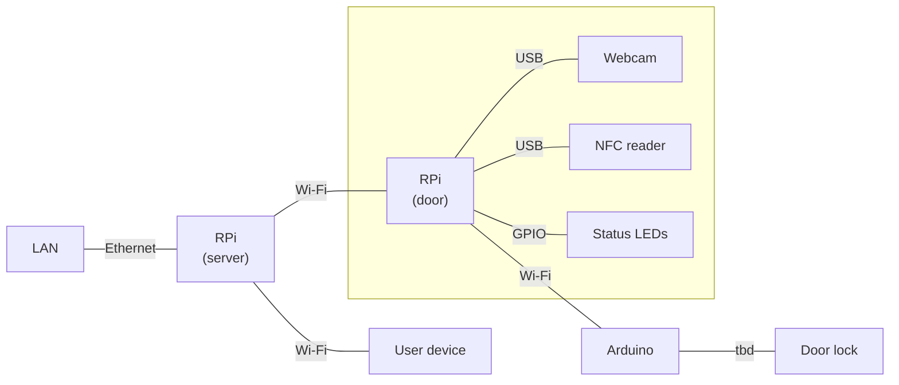

# bfc-project

## Architecture

## Explanation

Two Rasberrys, connected to the mains but also with fallback batteries in case of a power cut. The system can still authorize inputs even if the power goes out. It is necessary to identify the consumption but the most optimal would be to be able to survive one day.
An arduino inside the door, this one on battery. This separate element allows to isolate and secure the opening part of the door from other parts.  
We have thus:  
Raspberry Server that we connect in ethernet and that connects immediately to the network. Has an AP to connect automatically with its two devices and communicate on a private network between them.
It will be the gateway for the configuration, as well as the verifications to be made. Connected to a cloud service in order to monitor if necessary the remote maintenance.  

The camera is outside and so is the NFC reader, with a wire running through the wall to connect to the Raspberry.  
At startup, it automatically searches for the AP, there is a button to restart the search if needed.  
Both the camera and the NFC reader are wirely connected, so the NFC reader will be used first for the practical side for the user to badge and then put themselves in front of the camera. The algorithm computes the vector of the captured images and sends them to the other Raspberry which will make the verification and will send the order of opening or not to our other Raspberry.  

The two Raspberry communicate with wifi. We could use the modbus tcp/ip protocol because of its simplicity and low consumption.
The Raspberry server and the arduino communicate with Bluetooth Low Energy (BLE).

### How it works  
The external Raspberry waits for an NFC badge, which allows the system to be triggered when an attempt is made to enter (rather than being triggered when anyone approaches the door). As soon as the badge data is collected, it is sent via wifi to the Raspberry server. The server checks that the badge is valid, if it is, a signal is sent to the external Raspberry, if not, a red LED on the external box is lit. When the Raspberry outside receives that the badge is valid, it activates the camera, it tries to get a picture. When it arrives, it frames the picture around the head and sends it to the Raspberry server. The Raspberry server transforms it into a feature vector and compares it to the one it has stored for that person. If the comparison succeeds, a signal is sent to the arduino on the door to open it.  

### Security of the external Raspberry  
We detect that the box is removed, and if it is we dump the data on the external Raspberry.  

### Updating  
The server has access to the internet and a code repository. Every day at midnight the server checks the repository, if it detects a change in version for it or any of the two other devices it will update it, by transferring the data to the devices if necessary.  

### Connecting to the private network  
There is a button on the Raspberry.  

### Adding people (NFC badge and face)  
A computer or smartphone can connect to the private wifi. From there, it has access to a web page that allows it to configure the registered people. It can also switch the door's rasp to "recording" mode where the cameras will take pictures that will allow to record a new face. This operation must be repeated for each camera. This operation must be done once to register the badge.  
