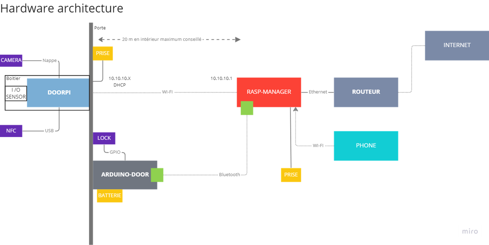

# bfc-project

## Architecture 



## Project documentation and useful links

* [Final oral presentation](https://docs.google.com/presentation/d/1rhgvDSc0gBMzTzFNjWXxOdjzocuDpinnN4yyvF7AuLI/edit?usp=sharing)
* [RaspImages](https://drive.google.com/drive/folders/1X3W6c0PDmoeBCr5fGeNgNKsXjTUhcAZK?usp=share_link)
* [Rasp-Manager](./Rasp-Manager/README.md)
* [DoorPi](./DoorPi/README.md)

## Installation

If you don't want to bother yourself with installation procedures, you can find in the link below a ready to use image for both Raspberry Pi 3B+

* [RaspImages](https://drive.google.com/drive/folders/1X3W6c0PDmoeBCr5fGeNgNKsXjTUhcAZK?usp=share_link)

If you still want to do it manually, you can find the steps to follow in each folders. (at your own risk)

Passwords for rasp-manager wifi is : raspberry   
Login info for both images is :  
user : pi  
pwd : pi
## Explanation

This projects presents a design and implementation of a smart door lock system utilizing two Raspberry Pi computers, an Arduino, a camera, and an NFC reader. One of the Raspberry Pi is entitled DoorPi while the other is named Rasp-Manager.
This system relies on a private network connection between the devices to ensure secure communication and authorization of inputs. The Rasp-Manager deploys a Wi-Fi access point when powered up allowing communication with DoorPi. A Bluetooth Low Energy communication is used between Rasp-Manager and Arduino. In the event of a power outage, the system is equipped with fallback batteries to ensure continued functionality. 
The camera and NFC reader are positioned outside of the door and connected to DoorPi. It is powered with a wire running through the wall. The NFC reader is used for practical user identification while the camera will capture the detected user's face for verification by the Rasp-Manager's VGGFace machine learning model.  The implementation and design of this smart door lock system demonstrate a secure and power-efficient means of controlling access to a physical space while respecting the owner's privacy with no data sent over the internet.

### How it works  
DoorPi waits for an NFC badge, which allows the system to be triggered when an attempt is made to enter (rather than being triggered when anyone approaches the door). As soon as the badge data is collected, it is sent via wifi to the Rasp-Manager. The server checks that the badge is valid, if it is, a signal is sent to the external Raspberry. When the Raspberry outside receives that the badge is valid, it activates the camera, it tries to get a picture. When it arrives, it frames the picture around the head and sends it to the Raspberry server. The Raspberry server transforms it into a feature vector and compares it to the one it has stored for that person. If the comparison succeeds, a signal is sent to the arduino on the door to open it.  

### Security of the external Raspberry  
We detect that the box is removed, and if it is we shred the data on the external Raspberry.  

### Updating  
The server has access to the internet and a code repository. Every day at midnight the server checks the repository, if it detects a change in version for it or any of the two other devices it will update it, by transferring the data to the devices if necessary.  
  

### Adding people (NFC badge and face)  
``` disclaimer : this part has not been implemented through a proper web page but the route to register a new face is available```  
A computer or smartphone can connect to the private wifi. From there, it has access to a web page that allows it to configure the registered people. It can also switch the door's rasp to "recording" mode where the cameras will take pictures that will allow to record a new face. This operation must be repeated for each camera. This operation must be done once to register the badge.  


