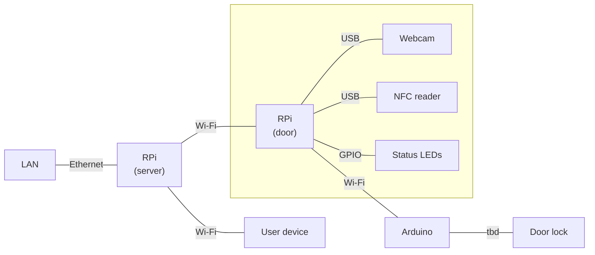

# bfc-project

## Architecture

```mermaid
graph LR
    F[LAN] --- |Ethernet| A
    A["RPi<br>(server)"] --- |Wi-Fi| B["RPi<br>(door)"]
    B --- |USB| C[Webcam]
    B --- |USB| D[NFC reader]
    B --- |Wi-Fi| I[Arduino]
    B --- |GPIO| G[Status LEDs]
    A --- |Wi-Fi| H[User device]
    I --- |tbd| J[Door lock]

    subgraph " "
        C;D;G;B
    end
```
